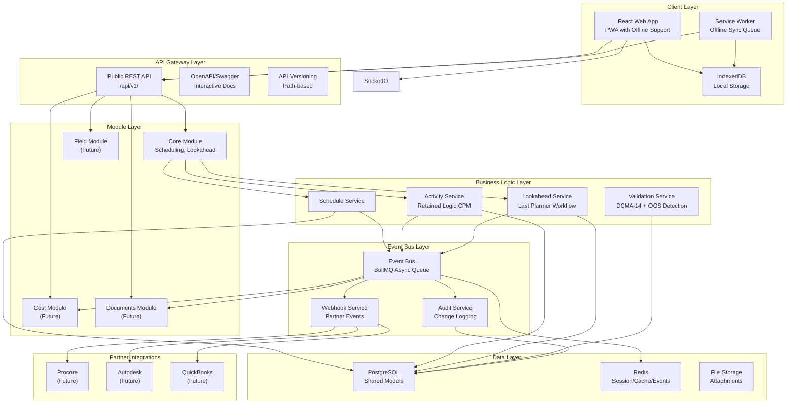
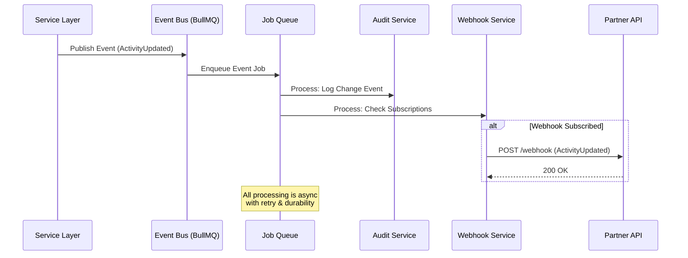

# Scheduler - Construction Project Management

A modern, web-based construction scheduling application designed to be more intuitive than Primavera P6 while providing superior functionality to Microsoft Project.

## Features

- **Master Schedule Management** - Create and manage comprehensive project schedules
- **Lookahead Schedules** - Field-level planning with Last Planner methodology
- **Approval Workflows** - Multi-stage approval process for schedule changes
- **Offline Support** - Work offline with automatic synchronization
- **Executive Dashboards** - Real-time project insights and financial drill-downs
- **Import/Export** - Support for XER (Primavera P6), XLSX, and XML formats
- **Resource Planning** - Staff management with forecasting and gap analysis

## Tech Stack

### Frontend
- React 18 with TypeScript
- Material-UI (MUI) for components
- Redux Toolkit for state management
- D3.js for Gantt charts
- Vite for build tooling
- Dexie.js for offline storage

### Backend
- Node.js with Express
- TypeScript
- Prisma ORM
- PostgreSQL database
- Redis for caching/sessions
- Socket.io for real-time updates
- Bull.js for job queues

## Getting Started

### Prerequisites

- Node.js 18+
- pnpm 9+
- Docker and Docker Compose
- Git

### Installation

1. **Clone the repository**
   ```bash
   git clone <repository-url>
   cd Scheduler
   ```

2. **Set up environment variables**
   ```bash
   cp .env.example .env
   # Edit .env with your configuration
   ```

2. **Install dependencies**
   ```bash
   pnpm install
   ```

3. **Start development services (PostgreSQL, Redis)**
   ```bash
   pnpm docker:up
   ```

4. **Set up environment variables**
   ```bash
   cp backend/.env.example backend/.env
   # Edit backend/.env with your configuration
   ```

5. **Run database migrations**
   ```bash
   pnpm db:migrate
   ```

6. **Start development servers**
   ```bash
   pnpm dev
   ```

   This will start:
   - Frontend at http://localhost:3000
   - Backend API at http://localhost:4000

### Available Scripts

| Command | Description |
|---------|-------------|
| `pnpm dev` | Start both frontend and backend in development mode |
| `pnpm dev:frontend` | Start only the frontend |
| `pnpm dev:backend` | Start only the backend |
| `pnpm build` | Build all packages for production |
| `pnpm lint` | Run ESLint on all packages |
| `pnpm test` | Run tests for all packages |
| `pnpm docker:up` | Start PostgreSQL and Redis containers |
| `pnpm docker:down` | Stop Docker containers |
| `pnpm db:migrate` | Run Prisma migrations |
| `pnpm db:seed` | Seed the database with sample data |

### Development Tools (Optional)

Start additional development tools:
```bash
docker-compose -f docker/docker-compose.yml --profile tools up -d
```

- **pgAdmin**: http://localhost:5050 (admin@scheduler.local / admin)
- **Redis Commander**: http://localhost:8081

## Architecture

### Overview

The Scheduler application is designed as a **modular, event-driven construction-tech ERM (Enterprise Resource Management) platform**. The core scheduling functionality serves as the central data backbone, with a deliberate architecture that enables seamless addition of new modules (cost management, document control, RFIs, daily logs, BIM integration) and partner integrations (Procore, Autodesk, Bluebeam, QuickBooks) without major refactoring.

**Key Architectural Principles:**

1. **Single Source of Truth** - All modules share the same Prisma models (Project, Activity, Resource, User, Company) to prevent data silos
2. **Event-Driven Communication** - Modules communicate via async event bus (BullMQ) for loose coupling
3. **No Direct Service Calls** - Modules do not directly import each other's services; use events/APIs instead
4. **API-First Design** - Versioned REST API (`/api/v1/`) with OpenAPI documentation
5. **Comprehensive Auditability** - Every write operation is logged for compliance and debugging
6. **Extensibility** - Module structure supports new domains without touching core code

### System Architecture



### Event-Driven Communication Flow



### Modular Architecture Principles

#### 1. Shared Models, Module-Specific Data

**Core entities** (Project, Activity, Resource, User, Company) are defined once in the Prisma schema and shared across all modules. This ensures a single source of truth and eliminates data silos.

**Module-specific data** uses dedicated tables linked by foreign keys:
- `DocumentVersion` (documents module) → references `Activity`
- `TimesheetEntry` (cost module) → references `StaffMember` and `Activity`
- `RfiReply` (RFI module) → references `Project` and `Activity`

All tables exist in one Prisma schema for referential integrity.

#### 2. Event-Driven Communication

Modules communicate via the async event bus (BullMQ) rather than direct service imports:

```typescript
// ✅ Good: Publish event
await eventBus.publish({
  type: 'activity.updated',
  entityId: activityId,
  entityType: 'ScheduleActivity',
  userId: userId,
  companyId: companyId,
  timestamp: new Date(),
  changes: { startDate: { old: oldDate, new: newDate } },
  scheduleId: scheduleId,
} as ActivityUpdatedEvent);

// ❌ Bad: Direct service import
import { costService } from '../modules/cost/services/costService.js';
await costService.updateBudget(activityId, newCost);
```

**Benefits:**
- Loose coupling between modules
- Independent development and deployment
- Automatic retry and durability
- Easy to add new event subscribers

#### 3. API Gateway Pattern

All public endpoints are versioned via URL path (`/api/v1/`):

- `/api/v1/core/schedules` - Core scheduling endpoints
- `/api/v1/cost/budgets` - Cost management endpoints (when enabled)
- `/api/v1/documents/rfis` - Document management endpoints (when enabled)

Module routes are protected by feature flags and return `503 Service Unavailable` if disabled.

#### 4. Comprehensive Audit Logging

Every write operation automatically generates an audit log entry:

```typescript
// Audit log includes:
{
  entityType: 'ScheduleActivity',
  entityId: 'activity-123',
  action: 'update',
  userId: 'user-456',
  companyId: 'company-789',
  changes: {
    startDate: { old: '2024-01-01', new: '2024-01-15' },
    duration: { old: 5, new: 7 }
  },
  metadata: { ip: '192.168.1.1', userAgent: '...' }
}
```

Audit logs are queryable via `/api/v1/audit` endpoints (admin/PM only).

### How to Add a New Module

#### Step 1: Create Module Directory Structure

```bash
backend/src/modules/
└── your-module/
    ├── services/
    │   └── yourModuleService.ts
    ├── controllers/
    │   └── yourModuleController.ts
    ├── routes/
    │   └── yourModuleRoutes.ts
    └── index.ts
```

#### Step 2: Define Module Service

```typescript
// backend/src/modules/your-module/services/yourModuleService.ts
import { prisma } from '../../../config/database.js';
import { eventBus } from '../../../services/eventBus.js';
import type { BaseEvent } from '@shared/events';

export class YourModuleService {
  async createSomething(data: CreateSomethingDto) {
    // 1. Create entity using shared Prisma models
    const entity = await prisma.yourEntity.create({ data });
    
    // 2. Publish event for other modules
    await eventBus.publish({
      type: 'your-module.created',
      entityId: entity.id,
      entityType: 'YourEntity',
      userId: data.userId,
      companyId: data.companyId,
      timestamp: new Date(),
    } as BaseEvent);
    
    // 3. Return result
    return entity;
  }
}

export const yourModuleService = new YourModuleService();
```

#### Step 3: Create Controller and Routes

```typescript
// backend/src/modules/your-module/controllers/yourModuleController.ts
import { Request, Response, NextFunction } from 'express';
import { yourModuleService } from '../services/yourModuleService.js';

export class YourModuleController {
  async create(req: Request, res: Response, next: NextFunction) {
    try {
      const result = await yourModuleService.createSomething(req.body);
      res.status(201).json(result);
    } catch (error) {
      next(error);
    }
  }
}

export const yourModuleController = new YourModuleController();
```

```typescript
// backend/src/modules/your-module/routes/yourModuleRoutes.ts
import { Router } from 'express';
import { yourModuleController } from '../controllers/yourModuleController.js';
import { authenticate, requireRole } from '../../../middleware/auth.js';
import { requireModule } from '../../../middleware/moduleCheck.js';

const router = Router();
router.use(authenticate);
router.use(requireModule('ENABLE_YOUR_MODULE')); // Feature flag check

router.post('/', yourModuleController.create.bind(yourModuleController));

export default router;
```

#### Step 4: Register Module in App

```typescript
// backend/src/app.ts
import yourModuleRoutes from './modules/your-module/routes/yourModuleRoutes.js';

// Register routes
app.use('/api/v1/your-module', yourModuleRoutes);
```

#### Step 5: Add Feature Flag

```typescript
// backend/src/config/modules.ts
export const moduleConfig: ModuleConfig = {
  // ... existing flags
  ENABLE_YOUR_MODULE: process.env.ENABLE_YOUR_MODULE === 'true' || 
    (process.env.NODE_ENV !== 'production' && process.env.ENABLE_YOUR_MODULE !== 'false'),
};
```

#### Step 6: Add Prisma Models (if needed)

```prisma
// backend/prisma/schema.prisma
model YourEntity {
  id        String   @id @default(uuid())
  projectId String   @map("project_id")
  // ... module-specific fields
  
  project Project @relation(fields: [projectId], references: [id])
  
  @@index([projectId])
  @@map("your_entities")
}
```

#### Step 7: Export from Module Index

```typescript
// backend/src/modules/your-module/index.ts
export { yourModuleService, YourModuleService } from './services/yourModuleService.js';
export { yourModuleController } from './controllers/yourModuleController.js';
export { default as yourModuleRoutes } from './routes/yourModuleRoutes.js';
```

### Event Catalog

The event bus supports the following event types. All events extend `BaseEvent` and include `entityId`, `entityType`, `userId`, `companyId`, `timestamp`, and optional `metadata`.

#### Activity Events

- **`activity.created`** - New activity created
  ```typescript
  {
    type: 'activity.created';
    scheduleId: string;
    activityName: string;
  }
  ```

- **`activity.updated`** - Activity modified
  ```typescript
  {
    type: 'activity.updated';
    scheduleId: string;
    changes: Record<string, { old: unknown; new: unknown }>;
  }
  ```

- **`activity.deleted`** - Activity removed
  ```typescript
  {
    type: 'activity.deleted';
    scheduleId: string;
    activityName: string;
  }
  ```

#### Schedule Events

- **`schedule.created`** - New schedule created
- **`schedule.updated`** - Schedule modified
- **`schedule.deleted`** - Schedule removed

#### Project Events

- **`project.created`** - New project created
- **`project.updated`** - Project modified
- **`project.deleted`** - Project removed

#### Lookahead Events

- **`lookahead.committed`** - Lookahead changes committed for approval
  ```typescript
  {
    type: 'lookahead.committed';
    lookaheadId: string;
    lookaheadName: string;
    activitiesCount: number;
  }
  ```

- **`lookahead.approved`** - Lookahead approved
- **`lookahead.rejected`** - Lookahead rejected

#### Approval Events

- **`approval.completed`** - Approval workflow completed
  ```typescript
  {
    type: 'approval.completed';
    lookaheadId: string;
    approvedBy: string;
    activitiesCount: number;
  }
  ```

- **`approval.rejected`** - Approval rejected
  ```typescript
  {
    type: 'approval.rejected';
    lookaheadId: string;
    rejectedBy: string;
    rejectionReason?: string;
  }
  ```

#### Resource Events

- **`resource.assigned`** - Resource assigned to activity
- **`resource.unassigned`** - Resource unassigned from activity

#### Staff Events

- **`staff.created`** - Staff member created
- **`staff.updated`** - Staff member modified
- **`staff.deleted`** - Staff member removed

#### Attachment Events

- **`attachment.uploaded`** - New attachment uploaded
- **`attachment.approved`** - Attachment approved
- **`attachment.rejected`** - Attachment rejected

### Integration Guidelines for Partners

#### Webhook Subscriptions

Partners can subscribe to events via the webhook API:

```bash
# Create webhook subscription
POST /api/v1/webhooks
{
  "url": "https://partner.com/webhook",
  "events": ["activity.updated", "approval.completed"],
  "secret": "your-hmac-secret"
}
```

#### Event Delivery

Events are delivered via HTTP POST with HMAC signature:

```http
POST https://partner.com/webhook
X-Webhook-Signature: sha256=abc123...
Content-Type: application/json

{
  "type": "activity.updated",
  "entityId": "activity-123",
  "entityType": "ScheduleActivity",
  "userId": "user-456",
  "companyId": "company-789",
  "timestamp": "2024-01-15T10:30:00Z",
  "changes": {
    "startDate": { "old": "2024-01-01", "new": "2024-01-15" }
  },
  "metadata": {}
}
```

#### HMAC Signature Verification

Partners should verify the `X-Webhook-Signature` header:

```typescript
import crypto from 'crypto';

function verifyWebhookSignature(
  payload: string,
  signature: string,
  secret: string
): boolean {
  const expectedSignature = crypto
    .createHmac('sha256', secret)
    .update(payload)
    .digest('hex');
  
  return crypto.timingSafeEqual(
    Buffer.from(signature.replace('sha256=', '')),
    Buffer.from(expectedSignature)
  );
}
```

#### Retry Logic

Webhook delivery includes automatic retry with exponential backoff:
- Initial retry: 1 second
- Max retries: 3 attempts (configurable)
- Backoff multiplier: 2x

Failed webhooks increment `failureCount` on the subscription. Subscriptions with high failure counts may be automatically disabled.

#### Testing Webhooks

Use the test endpoint to verify webhook delivery:

```bash
POST /api/v1/webhooks/:id/test
```

This sends a test event (`webhook.test`) to the subscription URL.

### Project Structure

```
Scheduler/
├── frontend/               # React frontend application
│   ├── src/
│   │   ├── components/    # React components
│   │   │   ├── common/    # Shared components
│   │   │   ├── schedules/ # Schedule-related components
│   │   │   ├── lookahead/ # Lookahead components
│   │   │   └── dashboards/# Dashboard components
│   │   ├── services/      # API and offline services
│   │   ├── store/         # Redux store and slices
│   │   ├── hooks/         # Custom React hooks
│   │   ├── utils/         # Utility functions
│   │   └── types/         # TypeScript types
│   └── package.json
├── backend/                # Node.js backend application
│   ├── src/
│   │   ├── config/        # Configuration files
│   │   │   ├── modules.ts # Module feature flags
│   │   │   └── swagger.ts # OpenAPI/Swagger config
│   │   ├── modules/       # Modular service organization
│   │   │   ├── core/      # Core scheduling module
│   │   │   │   ├── services/
│   │   │   │   ├── controllers/
│   │   │   │   ├── routes/
│   │   │   │   └── index.ts
│   │   │   ├── cost/      # Cost management (stub)
│   │   │   ├── documents/ # Document management (stub)
│   │   │   └── field/     # Field operations (stub)
│   │   ├── services/      # Shared services
│   │   │   ├── auditService.ts
│   │   │   ├── eventBus.ts
│   │   │   └── webhookService.ts
│   │   ├── controllers/   # Route controllers (legacy)
│   │   ├── middleware/    # Express middleware
│   │   ├── routes/        # API routes (legacy)
│   │   ├── utils/         # Utility functions
│   │   └── workers/       # Background job workers
│   ├── prisma/            # Prisma schema and migrations
│   └── package.json
├── shared/                 # Shared types and utilities
│   └── src/
│       ├── types.ts       # Prisma model types
│       ├── events.ts      # Event type definitions
│       └── index.ts       # Barrel exports
├── docker/                 # Docker configuration
│   └── docker-compose.yml
├── docs/                   # Documentation
├── package.json            # Root package.json (workspaces)
└── pnpm-workspace.yaml     # pnpm workspace configuration
```

## API Documentation

### Interactive API Explorer

The API is fully documented with OpenAPI/Swagger specification. Access the interactive API explorer at:

**Development:** http://localhost:4000/api-docs

The Swagger UI provides:
- Complete endpoint documentation
- Request/response schemas
- Authentication testing
- Try-it-out functionality

### API Versioning

All endpoints use URL path versioning:
- `/api/v1/` - Current stable version
- `/api/v2/` - Future version (when breaking changes are introduced)

Content negotiation within a version is supported via `Accept` header:
- `Accept: application/json` - JSON response (default)
- `Accept: text/csv` - CSV export (for applicable endpoints)

## API Endpoints

### Authentication
- `POST /api/v1/auth/login` - User login
- `POST /api/v1/auth/register` - User registration
- `POST /api/v1/auth/refresh` - Refresh access token
- `GET /api/v1/auth/me` - Get current user

### Projects
- `GET /api/v1/projects` - List projects
- `POST /api/v1/projects` - Create project
- `GET /api/v1/projects/:id` - Get project details
- `PUT /api/v1/projects/:id` - Update project
- `DELETE /api/v1/projects/:id` - Delete project

### Schedules
- `GET /api/v1/schedules/:id` - Get schedule
- `POST /api/v1/schedules` - Create schedule
- `PUT /api/v1/schedules/:id` - Update schedule
- `GET /api/v1/schedules/:id/activities` - Get activities
- `GET /api/v1/schedules/:id/baselines` - Get baselines
- `POST /api/v1/schedules/:id/baselines` - Create baseline

### Lookahead
- `GET /api/v1/lookaheads/:id` - Get lookahead schedule
- `POST /api/v1/lookaheads` - Create lookahead
- `POST /api/v1/lookaheads/:id/pull` - Pull from master
- `POST /api/v1/lookaheads/:id/commit` - Commit changes

### Workflows
- `GET /api/v1/workflows` - Get pending approvals
- `POST /api/v1/workflows/:id/approve` - Approve changes
- `POST /api/v1/workflows/:id/reject` - Reject changes

### Import/Export
- `POST /api/v1/import/xer` - Import XER file
- `POST /api/v1/import/xlsx` - Import Excel file
- `GET /api/v1/export/xer/:scheduleId` - Export to XER
- `GET /api/v1/export/pdf/:scheduleId` - Export to PDF

### Dashboard
- `GET /api/v1/dashboard/executive` - Executive dashboard data
- `GET /api/v1/dashboard/financial/:projectId` - Financial drill-down

### Audit Logs
- `GET /api/v1/audit` - Query audit logs (admin/PM only)
- `GET /api/v1/audit/entity/:entityType/:entityId` - Get entity audit trail

### Webhooks
- `POST /api/v1/webhooks` - Create webhook subscription
- `GET /api/v1/webhooks` - List webhook subscriptions
- `GET /api/v1/webhooks/:id` - Get webhook subscription
- `PUT /api/v1/webhooks/:id` - Update webhook subscription
- `DELETE /api/v1/webhooks/:id` - Delete webhook subscription
- `POST /api/v1/webhooks/:id/test` - Test webhook delivery

## Environment Variables

### Core Configuration

| Variable | Description | Default |
|----------|-------------|---------|
| `NODE_ENV` | Environment mode | `development` |
| `PORT` | Backend server port | `4000` |
| `DATABASE_URL` | PostgreSQL connection string | - |
| `REDIS_URL` | Redis connection string | `redis://localhost:6379` |
| `JWT_SECRET` | JWT signing secret | - |
| `JWT_EXPIRES_IN` | Access token expiry | `1d` |
| `FRONTEND_URL` | Frontend URL for CORS | `http://localhost:3000` |
| `API_URL` | API base URL | `http://localhost:4000/api/v1` |

### Module Flags (Phase 9)

Control which modules are enabled. In development, modules default to enabled unless explicitly disabled. In production, modules default to disabled unless explicitly enabled.

| Variable | Description | Default |
|----------|-------------|---------|
| `ENABLE_COST_MODULE` | Enable cost management module | `false` (prod), `true` (dev) |
| `ENABLE_DOCS_MODULE` | Enable document management module | `false` (prod), `true` (dev) |
| `ENABLE_RFI_MODULE` | Enable RFI management module | `false` (prod), `true` (dev) |
| `ENABLE_DAILY_LOGS_MODULE` | Enable daily logs module | `false` (prod), `true` (dev) |
| `ENABLE_FIELD_MODULE` | Enable field operations module | `false` (prod), `true` (dev) |

### Partner Integrations

| Variable | Description | Default |
|----------|-------------|---------|
| `PARTNER_WEBHOOKS` | Master switch for all partner webhooks | `false` |
| `ENABLE_PROCORE_WEBHOOKS` | Enable Procore webhook integration | `false` |
| `ENABLE_AUTODESK_WEBHOOKS` | Enable Autodesk webhook integration | `false` |
| `ENABLE_QUICKBOOKS_WEBHOOKS` | Enable QuickBooks webhook integration | `false` |
| `ENABLE_BLUEBEAM_WEBHOOKS` | Enable Bluebeam webhook integration | `false` |

### Webhook Configuration

| Variable | Description | Default |
|----------|-------------|---------|
| `WEBHOOK_SECRET` | HMAC secret for webhook signing | - |
| `WEBHOOK_RETRY_ATTEMPTS` | Number of retry attempts for failed webhooks | `3` |
| `WEBHOOK_TIMEOUT_MS` | Webhook request timeout in milliseconds | `10000` |

### Email Configuration

| Variable | Description | Default |
|----------|-------------|---------|
| `SMTP_HOST` | SMTP server hostname | `localhost` |
| `SMTP_PORT` | SMTP server port | `587` |
| `SMTP_USER` | SMTP username | - |
| `SMTP_PASSWORD` | SMTP password | - |
| `SMTP_FROM` | Default sender email address | `noreply@scheduler.com` |

See `.env.example` for a complete template with all available environment variables.

## Contributing

1. Create a feature branch from `main`
2. Make your changes
3. Run linting and tests: `pnpm lint && pnpm test`
4. Submit a pull request

## License

MIT License - see [LICENSE](LICENSE) for details.
